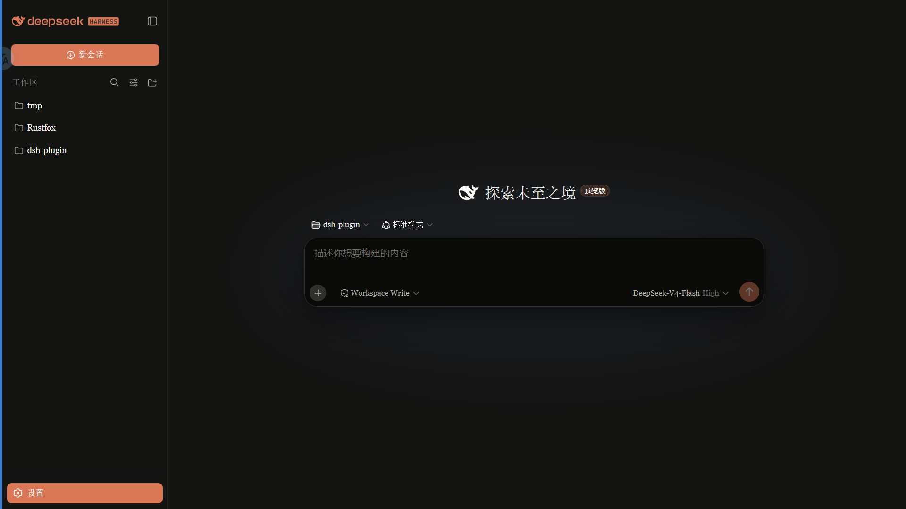
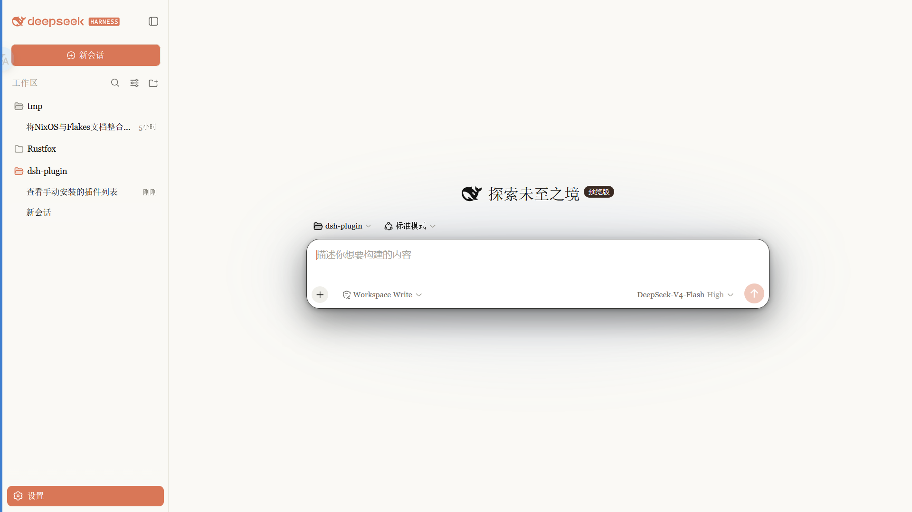

# dsh-client-ui-skin-claude

A Claude-style skin for the [DeepSeek Harness](https://github.com/deepseek-ai/deepseek-harness) (dsh) Web GUI — warm-black canvas, Anthropic clay accent, serif UI, and the polished component details that make Claude feel like Claude.




## Features

- **Anthropic official brand palette** — warm-black `#141413`, elevated `#262624`, deep input `#0a0a09`, clay accent `#d97757`, cream `#faf9f5`
- **Claude typography** — serif UI (Georgia fallback of Anthropic Serif Web Text), serif headlines, Anthropic Mono stack for code
- **Component details** — slim rounded scrollbars, clay selection highlight, clay focus rings, 8px buttons/inputs, pill badges, 12px cards, raised active tabs, layered shadows, tracked-out captions
- **Native light/dark** — follows the dsh theme switch, both variants styled
- **Presentation-only** — no services injected, no cordis events, no model requests; every write retracted on dispose
- **No build step** — the bundle is hand-written in the official `__ModuleLoader__` format
- **No external assets** — system fonts only, works offline

## Install

```sh
dsh plugin --profile web add link:/path/to/dsh-client-ui-skin-claude
```

or from this repo:

```sh
dsh plugin --profile web add github:PAKIKNOWLEDGE/dsh-client-ui-skin-claude
```

Then restart `dsh web` (a new bundle layer requires a restart), refresh the page.

## Switching

Only one skin is ever active at a time. Enable this skin by editing
`~/.dsh/cordis.patch.yml`:

```yaml
# outside the dsh-skin managed section
- insert:
    - id: ui-skin-claude
      name: '@dsh-external/dsh-client-ui-skin-claude'
```

(and `disabled: true` the currently active skin's row). The config watcher
hot-reloads within seconds; refresh the page. You can also use the
[dsh-skin](https://github.com/KinGao294/dsh-skin) switcher if it recognizes it.

## Uninstall

1. Remove the `ui-skin-claude` insert row from `~/.dsh/cordis.patch.yml`.
2. `dsh plugin --profile web remove @dsh-external/dsh-client-ui-skin-claude`
3. Restart `dsh web`.

## Project layout

```
dsh-client-ui-skin-claude/
├── package.json      # official dsh bundle manifest (dsh.bundle + dsh.client)
├── cordis.patch.yml  # inserts the ui-skin-claude loader row on install
├── skin.json         # skin-center registry metadata
├── lib/
│   ├── index.js      # no-op host entry
│   └── client.js     # hand-written browser bundle (no build step)
└── README.md
```

## Design reference

The palette and component details are aligned with Anthropic's official brand
tokens and the community-documented Claude design system (Copernicus/Tiempos
headlines, StyreneB body with Inter fallback, JetBrains Mono code, clay
`#d97757` accent on warm-black `#141413`).

## License

MIT
